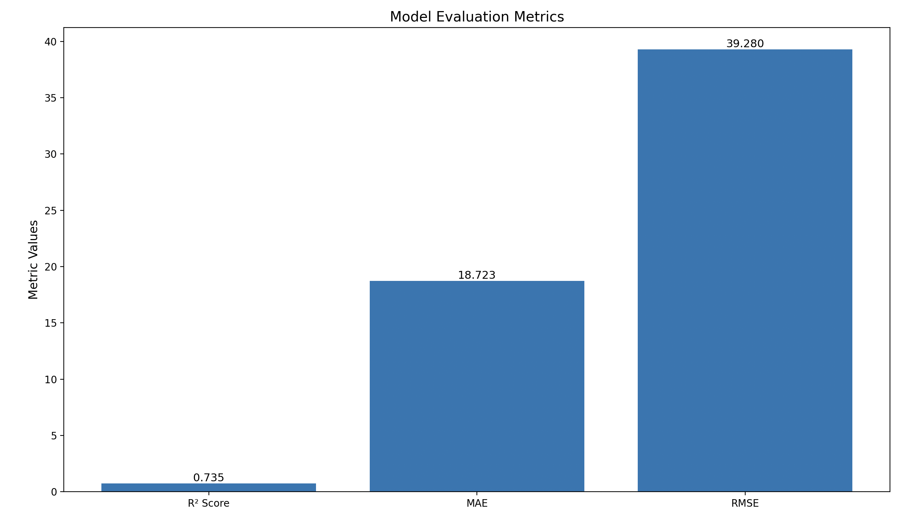

RezoX AI: Real Estate Management & Price Prediction Platform

This project uses Machine Learning to predict real estate prices in Bengaluru and provides insights using data-driven evaluation metrics.

Model Evaluation Metrics
Below is the performance visualization of the model on the test dataset:

  

Interpretation

| Metric       | Value        | Meaning                                                             |
| ------------ | ------------ | ------------------------------------------------------------------- |
| **R² Score** | 0.735        | Model explains ~73.5% of price variance → decent prediction ability |
| **MAE**      | 18.723 Lakhs | Avg error → predictions may deviate by ₹18.7 Lakhs on average       |
| **RMSE**     | 39.280 Lakhs | Penalizes larger errors → shows some impact of outliers            |
